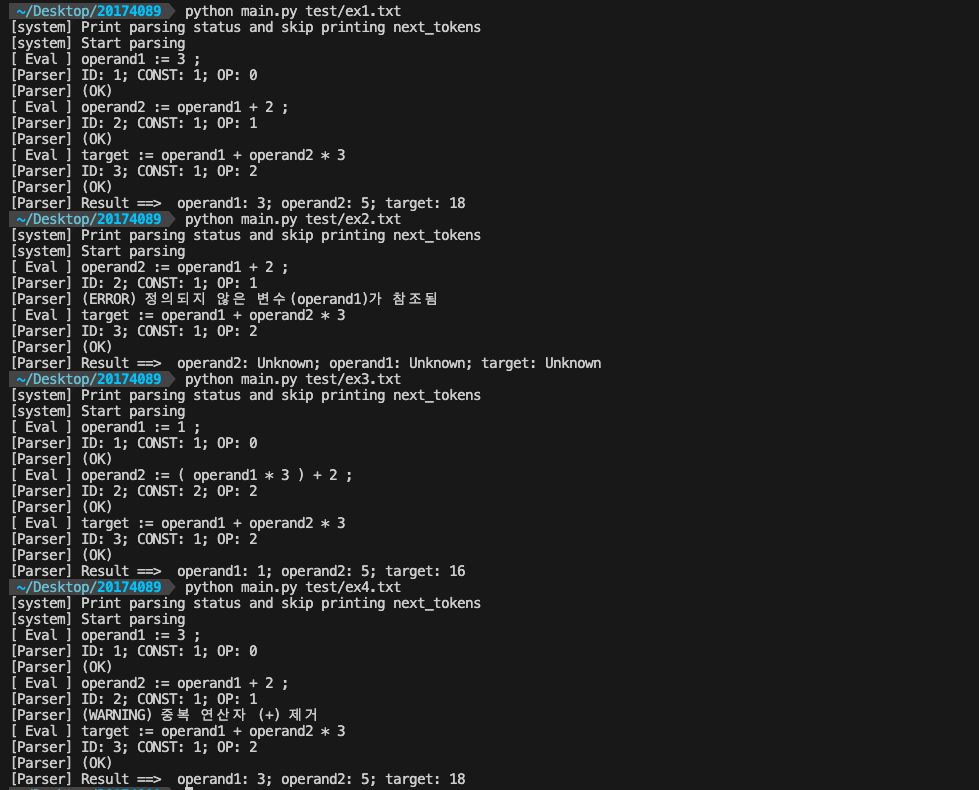
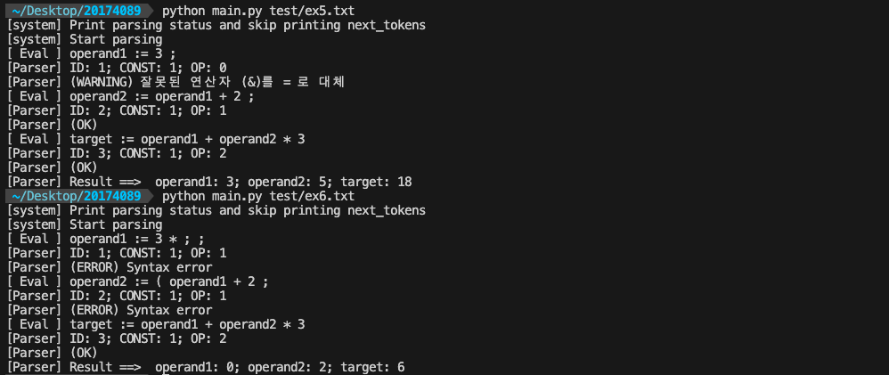

# Building Recursive Descent Parser
Parser for the codes which follow the LL(1) grammar given below.

## How to run
```
> python main.py test/ex1.txt
```
```
> [system] Print parsing status and skip printing next_tokens
> [system] Start parsing
> [ Eval ] operand1 := 3 ;
> [Parser] ID: 1; CONST: 1; OP: 0
> [Parser] (OK)
```
Print parsing result.


```
> python main.py test/ex1.txt -v
```
```
# output
> [system] Print next_token when everytime it changes
> [system] Start parsing
> [Lexer] : Next token is  operand1
> [Lexer] : Next token is  :=
> [Lexer] : Next token is  3
> [Lexer] : Next token is  ;
```
Print _next_token whenever it changes.


## BNF Rules
```
<program> → <statements>
<statements> → <statement> | <statement><semi_colon><statements>
<statement> → <ident><assignment_op><expression>
<expression> → <term><term_tail>
<term_tail> → <add_op><term><term_tail> | ε
<term> → <factor> <factor_tail>
<factor_tail> → <mult_op><factor><factor_tail> | ε
<factor> → <left_paren><expression><right_paren> | <ident> | <const>
<const> → any decimal numbers
<ident> → any names conforming to C identifier rules
<assignment_op> → :=
<semi_colon> → ;
<add_operator> → + | -
<mult_operator> → * | /
<left_paren> → (
<right_paren> → )
```
## Lexer
``` 
def get_char():  # get the next character of input and determine its character class  
def add_char():  # add nextChar to lexeme
def lookup(ch):  # lookup operators and parentheses and return the token
def lex():       # lexical analyzer for arithmetic expressions
```
## Parser
``` 
def error():         # Detect '(ERROR) Syntax error'
def factor():        # <factor> → <left_paren><expression><right_paren> | <ident> | <const>
def factor_tail():   # <factor_tail> → <mult_op><factor><factor_tail> | ε
def term():          # <term> → <factor> <factor_tail>
def term_tail():     # <term_tail> → <add_op><term><term_tail> | ε
def expression():    # <expression> → <term><term_tail>
def statement():     # <statement> → <ident><assignment_op><expression>
def statements():    # <statements> → <statement>| <statement><semi_colon><statements>
def program():       # <program> -> <statements>
```

## Semantic Analysis : simple arithmetic equation eval
```
def eval_stack():  
```
Convert _parsing_stack which is generated by parser into a prefix equation and construct a symbol table.
Based on the symbol table, evaluate equation.

And also detect an error of referencing undefined variables. If it has been detected, set all the evaulation results 'Unknown' and keep proceeding syntax analysis til the end of the code.


## Syntax Error Recovery

### 1. [line : 190] def eval_stack():
```
> operand2 := operand1 + 2 ;     # referencing undefined variable
```
Set the values of operand2 and operand1 with 'unknown' and proceed parsing 

### 2. [line : 323] def term_tail():
```
> operand2 := operand1 + + 2 ;     # duplicated operators
```
Remove duplicated operator and proceed parsing with the new statement, ```operand2 := operand1 + 2```


### 3. [line : 357] def statement():
```
> operand1 & 3;    # change & into = to fix statement
```
If no semi-colon has been found, then replace the most likely wrong operator into semi-colon 


### 4. [line : 261] def error():
```
> operand1 := 3 *;              # missing a operand
> operand2 := ( operand1 + 2 ;  # missing a right parenthesis
```
Even when we face syntax errors like above, print error message and keep doing syntax analysis until the end of the code.
## Test Results


